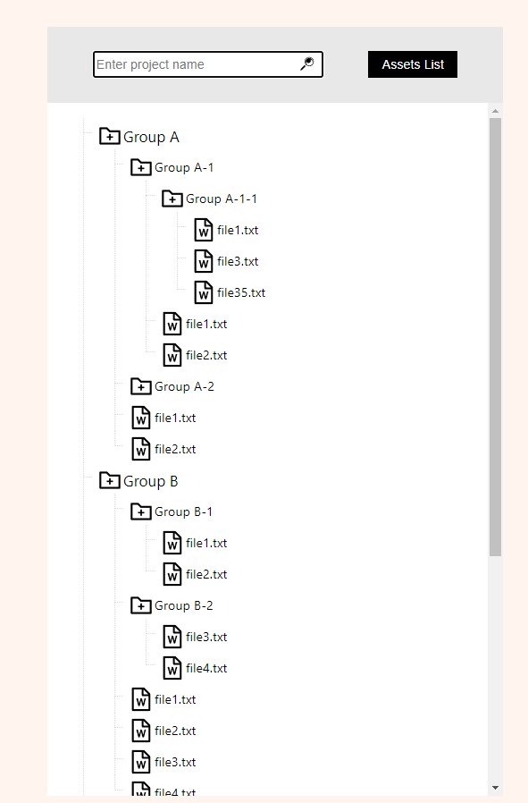

# Treeview component exercise

The Tree-Exercise - Kokoapps -Avner Loubaton

## The component should:

- Recursive search
- Supports collapsing / expanding status with icons
- Able to distinguish directories from files
- Supports vertical scrolling
